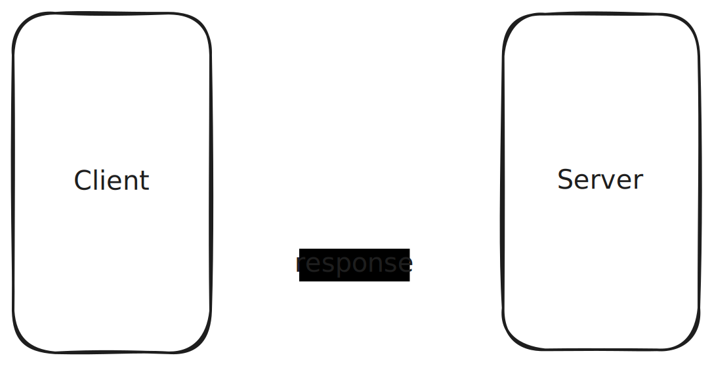
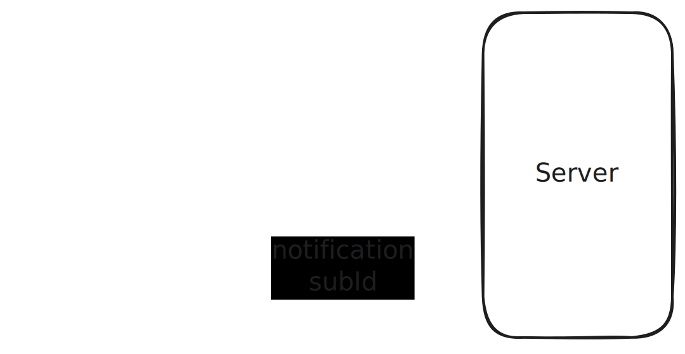

# JSON-RPC Spec

---

# JSON-RPC Spec

## What you will learn:

- What is JSON-RPC (v2)
  - Its stateless design
  - Conventions to make it stateful

<!-- .element: class="fragment" -->

- (Substrate) JSON-RPC Spec
  - Objectives
  - Versioning
  - Groups of functions
  - Overview

<!-- .element: class="fragment" -->

---

## JSON-RPC 2.0

- JSON-RPC is a stateless, transport agnostic, light-weight remote procedure call (RPC) protocol.<!-- .element: class="fragment" -->
- Defines basic data-structures and the rules around their processing. It is transport agnostic.<!-- .element: class="fragment" -->

---

## JSON-RPC 2.0 - Request Object

```ts
{
  id: number | string | null,
  method: string,
  params?: Array<any> | Record<string, any>
}
```

---

## JSON-RPC 2.0 - Notification Object

```ts
{
  method: string,
  params?: Array<any> | Record<string, any>
}
```

Notes:

Like `Request` but without an `id`

---

## JSON-RPC 2.0 - Response

##### Success

```ts
{
  id: number | string | null,
  result: any
}
```

##### Error

```ts
{
  id: number | string | null,
  error: {
    code: number,
    message: string,
    data?: any
  }
}
```

Notes:

`code`: number that indicates the type of error. Error codes from -32768 to -32000 are reserved for pre-defined errors.

---

## JSON-RPC 2.0 Examples

https://www.jsonrpc.org/specification#examples

---

## Stateful connections and subscriptions



Notes:

https://excalidraw.com/#json=d-_ZoxX3cx8MJYiniJ0uS,i8WuAaK0yuV1kUT3TbDbIQ

JSON-RPC is designed on a client-server model of request/responses, as it is transport-agonstic and this way it can support transports that don't have server->client notifications.

If we want those kind of communications, to support things like subscriptions, we can just compose it by flipping the client/server roles (as long as the transport we use allows it).

---

## Stateful connections and subscriptions



---

## Stateful connections and subscriptions

```ts
>> { id: 0, method: "subscribe_to_news", params: { cb: "news_update" } }
<< { id: 0, result: "news-sub-1" }
…
…
<< { method: "news_update", params: {
  subscription: "news-sub-1",
  title: "PBA dev compiles runtime in under 4 hours. Here's their secret"
} }
```

---

# JSON-RPC in Polkadot

- "Legacy" API <!-- .element: class="fragment" -->
- New JSON-RPC Spec API <!-- .element: class="fragment" -->

Notes:

Initially, the JSON-RPC methods to interact with a chain were all created ad-hoc, with no proper spec.

This created many inconstistencies across different methods, others that do the same behaviour but differently, and also incompatibilities with light clients.

There was a turning point when they decided to write a proper spec with a set of methods that tailor multiple actors.

---

## Why a New JSON-RPC API?

- Standardizing JSON-RPC requests across the Polkadot ecosystem<!-- .element: class="fragment" -->
- Removing inconsistencies<!-- .element: class="fragment" -->
- Providing better support for light clients and alternative runtimes<!-- .element: class="fragment" -->

**Notes:**

TODO

- The previous JSON-RPC implementation had inconsistencies that made it harder for developers to maintain compatibility across parachains.
- A key motivation was to improve support for lightweight clients, which require a more optimized and reliable data-fetching mechanism.

---

## Key Changes & Improvements

- **Groups of functions:** Based on node capabilities
- **Stability and versioning:** Allowing improvements without breaking contracts.
  - Functions are grouped by node capabilities: `chainHead`, `archive`, `sudo`, `transaction`, …
  - Consistent naming: `{group}_{version}_{method}`: `chainHead_v1_follow`, `archive_v1_storage`, `sudo_unstable_pendingTransactions`, …
  - Capability detection via the `rpc_methods` function

<!-- .element: class="fragment" -->

- **Better Error Handling:** Clearer and documented errors.

<!-- .element: class="fragment" -->

- **Load Balancer Friendly:** A load balancer can move a client from one server to another (and thus shut down servers that it doesn’t need anymore).

<!-- .element: class="fragment" -->

**Notes:**

- Method names have been changed to be more descriptive and standardized.

- Errors are now structured in a way that makes debugging and handling failures easier.

- The API reduces redundant calls, leading to lower latency and better efficiency.

- Node types: Full, Light, Archive, Plain databases

- Grouping functions using prefixes with versioning ensures clear evolution and compatibility.
- Each node type supports functions based on its capabilities, ensuring efficient and relevant operations.
- Clients should always use `rpc_methods` to verify supported functions on a given node.

- Upgrading function groups ensures that newer functions are clearly distinct from older ones.
- This separation simplifies development and reduces confusion when interacting with nodes of different capabilities.
- Developers can choose which version to rely on, knowing the functional boundaries.

- Unstable functions are meant for experimental use and may evolve or be removed at any time.
- They are helpful for developers needing temporary functions for debugging or testing.
- Applications should avoid relying on unstable functions for critical features.

---

## Audiences

- **End-User Applications**
  - Light-client support.
  - Minimize risks on single-point of failure.

<!-- .element: class="fragment" -->

- **Node Operators**
  - Node monitoring

<!-- .element: class="fragment" -->

- **Oracles & Bridges**
  - Automated interaction with the blockchain

<!-- .element: class="fragment" -->

- **Archivers / Indexers**
  - Access to historical blockchain data
  - Focus on finalized blocks

<!-- .element: class="fragment" -->

**Notes:**

- End-user applications, like wallets, should prioritize using locally-run nodes to enhance security and decentralization.
- Light clients, which don't hold full blockchain storage, are encouraged for better usability.
- The API design mitigates potential DoS vulnerabilities while ensuring precise and efficient operations.

- Node operators require tools to monitor and manage nodes efficiently.
- Stability in API functions is essential for reliable scripting and automation.
- Tools like `websocat` facilitate interaction with JSON-RPC through WebSockets.

- Oracles and bridges require reliable and automated blockchain interaction.
- Although automated, their operational needs align with those of end-user-facing applications.
- Ensuring security and stability is paramount.

- Archivers need to access and analyze past blockchain states, focusing on finalized data.
- The API ensures stability and ease of use, simplifying data retrieval for archival purposes.
- Performance is less critical, but stability and reliability are key.

---

# Overview:

- chainhead<!-- .element: class="fragment" -->
- archive<!-- .element: class="fragment" -->
- chainSpec<!-- .element: class="fragment" -->
- sudo\_\*<!-- .element: class="fragment" -->
- transaction<!-- .element: class="fragment" -->
- transactionWatch<!-- .element: class="fragment" -->

---

# Questions & Discussion

- Feel free to ask any questions!

<!-- .element: class="fragment" -->

- Check the full objectives: [Parity Spec Link](https://paritytech.github.io/json-rpc-interface-spec/objectives.html)

<!-- .element: class="fragment" -->

- Further reading: [New JSON-RPC API mega Q&A](https://forum.polkadot.network/t/new-json-rpc-api-mega-q-a/3048)

<!-- .element: class="fragment" -->

**Notes:**

TODO

- Encourage the audience to ask questions about their specific use cases or integration concerns.
- Refer to the full objectives document for detailed insights and ongoing updates.
